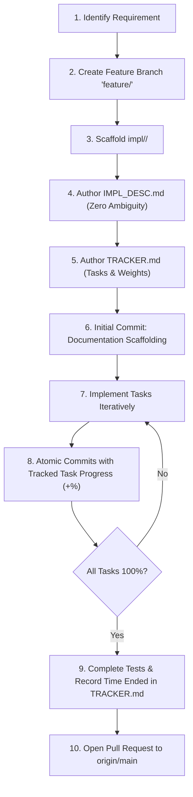

# Contributing to Waddle-LSW

Thank you for your interest in contributing to **Waddle-LSW** (Waddle Linux Subsystem for Windows)!

Waddle-LSW is an open-source, high-performance compatibility layer designed to deliver seamless, borderless integration of Microsoft Windows applications directly into Linux Wayland desktop environments.

This guide provides comprehensive instructions for developers, engineers, and AI agents contributing to the project. It builds directly upon the authoritative rules defined in [AGENTS.md](file:///home/dev/Waddle-LSW/AGENTS.md) and the architectural foundation outlined in [PROJECT.md](file:///home/dev/Waddle-LSW/PROJECT.md).

---

## Table of Contents

1. [Governance & Core Operating Principles](#1-governance--core-operating-principles)
   - [Relationship to AGENTS.md](#relationship-to-agentsmd)
   - [Core Principles](#core-principles)
2. [Architecture Overview & Subsystems](#2-architecture-overview--subsystems)
3. [Development Environment Setup](#3-development-environment-setup)
   - [Linux Host Environment](#linux-host-environment)
   - [Windows Guest Environment](#windows-guest-environment)
   - [Testing VM / QEMU Setup](#testing-vm--qemu-setup)
   - [Standalone & Mock Development Mode](#standalone--mock-development-mode)
4. [Branching & Workflow Lifecycle](#4-branching--workflow-lifecycle)
   - [Branch Selection Matrix](#branch-selection-matrix)
   - [Feature Implementation Lifecycle (`impl/`)](#feature-implementation-lifecycle-impl)
   - [Authoring `IMPL_DESC.md`](#authoring-impl_descmd)
   - [Maintaining `TRACKER.md`](#maintaining-trackermd)
5. [Git Submodules & External Dependency Management](#5-git-submodules--external-dependency-management)
   - [Submodule Architecture & Directory Conventions](#submodule-architecture--directory-conventions)
   - [Step-by-Step Guide: Adding a Git Submodule](#step-by-step-guide-adding-a-git-submodule)
   - [Handling Submodules in Feature Branches](#handling-submodules-in-feature-branches)
   - [Bumping and Updating an Existing Submodule](#bumping-and-updating-an-existing-submodule)
   - [Safely Removing a Submodule](#safely-removing-a-submodule)
   - [Build System Integration](#build-system-integration)
   - [CI/CD Pipeline & Automated Verification](#cicd-pipeline--automated-verification)
6. [Coding Standards & Architectural Conventions](#6-coding-standards--architectural-conventions)
   - [Language Selection Policy](#language-selection-policy)
   - [Code Beauty & Naming Invariants](#code-beauty--naming-invariants)
   - [Documentation Enforcement Standards](#documentation-enforcement-standards)
   - [Memory Safety & Zero-Leak Architecture](#memory-safety--zero-leak-architecture)
   - [Shared Memory (IVSHMEM) & Concurrency Rules](#shared-memory-ivshmem--concurrency-rules)
   - [IPC Protocol & Struct Serialization](#ipc-protocol--struct-serialization)
   - [Wayland Client Best Practices](#wayland-client-best-practices)
   - [Win32 & DirectX Best Practices](#win32--directx-best-practices)
   - [Error Handling & Resilience](#error-handling--resilience)
7. [Testing, Sanitizers & Performance Verification](#7-testing-sanitizers--performance-verification)
   - [Unit & Integration Testing](#unit--integration-testing)
   - [Zig Built-in Test Harness & Specifications](#zig-built-in-test-harness--specifications)
   - [Code Coverage Enforcement](#code-coverage-enforcement)
   - [Sanitizers & LeakSanitizer Zero-Leak Gating](#sanitizers--leaksanitizer-zero-leak-gating)
   - [Performance & Latency Benchmarks](#performance--latency-benchmarks)
8. [Commit Standards & Hygiene](#8-commit-standards--hygiene)
9. [Pull Request (PR) & Merging Process](#9-pull-request-pr--merging-process)
10. [Security & Vulnerability Disclosure](#10-security--vulnerability-disclosure)

---

## 1. Governance & Core Operating Principles

### Relationship to AGENTS.md

The operational rules in [AGENTS.md](file:///home/dev/Waddle-LSW/AGENTS.md) are **strictly binding** for all contributors—both human developers and AI pair programmers. 

- **[AGENTS.md](file:///home/dev/Waddle-LSW/AGENTS.md)** sets the non-negotiable rules for branching, commit atomicity, zero ambiguity, implementation tracking schemas, and PR merge criteria.
- **[CONTRIBUTING.md](file:///home/dev/Waddle-LSW/CONTRIBUTING.md)** operationalizes those rules into practical development workflows, providing detailed toolchain setups, subsystem coding standards, testing instructions, and practical examples.

If any contradiction arises between this document and `AGENTS.md`, **[AGENTS.md](file:///home/dev/Waddle-LSW/AGENTS.md) takes precedence**.

### Core Principles

1. **Atomic & Frequent Commits**:
   - Every discrete change (e.g., adding a struct definition, implementing a callback, updating a single test case) must receive its own atomic commit.
   - Do not batch multiple unrelated changes into a single commit.
   - Never leave completed work uncommitted in your working tree.
2. **Zero Ambiguity Policy**:
   - All designs, protocols, boundary conditions, and memory layouts must be thoroughly documented in minute detail in `impl/<feature-title>/IMPL_DESC.md` before or during implementation.
   - Ambiguities in synchronization models, byte order, coordinate transformations, or failure modes must be explicitly resolved in writing.
3. **Strict Progress Auditing**:
   - All feature work must track progress in `impl/<feature-title>/TRACKER.md`.
   - Every commit to a feature branch must explicitly document its incremental contribution (`+/- %`) to specific task IDs.

---

## 2. Architecture Overview & Subsystems

Before contributing code, familiarize yourself with the three core subsystems detailed in [PROJECT.md](file:///home/dev/Waddle-LSW/PROJECT.md):

```
+-------------------------------------------------------------------------+
|                              LINUX HOST                                 |
|  - Host Compositor Client (Wayland xdg-shell, dmabuf, viewporter)       |
|  - Host Wayland Compositor (KWin, Mutter, wlroots, Hyprland, Sway)      |
+------------------------------------+------------------------------------+
                                     |
    VirtIO-Serial / AF_VSOCK (IPC)   |   IVSHMEM / KVMFR (Frames)
                                     |
+------------------------------------+------------------------------------+
|                         HYPERVISOR / KVM / QEMU                         |
+------------------------------------+------------------------------------+
                                     |
+------------------------------------+------------------------------------+
|                            WINDOWS GUEST                                |
|  - Guest Agent (SetWinEventHook, DWM capture, DXGI/D3D surfaces)        |
|  - Synthetic Input Injector (SendInput / Raw Input)                     |
|  - Filesystem & GPU: WinFsp + VirtIO-FS, vGPU / GPU-PV                  |
+-------------------------------------------------------------------------+
```

1. **Host-Side Wayland Compositor Client**:
   - Runs as a native Linux client communicating with the host Wayland compositor.
   - Maps Windows application surfaces onto native `xdg_toplevel` and `wl_subsurface` entities.
   - Handles host mouse/keyboard input and translates coordinates to guest space.
2. **IPC & Buffer Transport Layer**:
   - Bidirectional control channel using `AF_VSOCK` or VirtIO-Serial for low-latency JSON-RPC or binary message exchange.
   - Data channel leveraging partitioned IVSHMEM / KVMFR shared memory for zero-copy frame blitting and DMA-BUF imports.
3. **Guest-Side Window Tracking & Capture Agent**:
   - Windows userland service tracking window lifecycles and topologies via Win32 Shell hooks (`SetWinEventHook`).
   - Captures per-window surfaces via Windows Graphics Capture (`Windows.Graphics.Capture`) or DXGI Desktop Duplication with alpha channel preservation.
   - Delivers frames into IVSHMEM ring buffers and injects synthetic input from the host.

---

## 3. Development Environment Setup

Because Waddle-LSW spans host Linux and guest Windows environments, contributors can configure either the full end-to-end environment or develop against simulated/mock interfaces.

### Linux Host Environment

The Linux host component requires modern C++20 and/or Rust toolchains alongside Wayland and DRM development packages.

#### 1. System Dependencies (Debian / Ubuntu 22.04+ or Fedora 38+)

**Debian / Ubuntu**:
```bash
sudo apt update
sudo apt install -y \
    build-essential \
    clang-16 clang-format-16 clang-tidy-16 \
    cmake ninja-build pkg-config \
    libwayland-dev wayland-protocols \
    libxkbcommon-dev libxkbcommon-x11-dev \
    libdrm-dev libepoxy-dev libgbm-dev \
    libgl1-mesa-dev libvulkan-dev \
    virtiofsd qemu-system-x86
```

**Fedora / RHEL**:
```bash
sudo dnf install -y \
    clang clang-tools-extra \
    cmake ninja-build pkgconf-pkg-config \
    wayland-devel wayland-protocols-devel \
    libxkbcommon-devel libdrm-devel \
    libepoxy-devel mesa-libgbm-devel \
    virtiofsd qemu-system-x86
```

#### 2. Rust Toolchain (Optional / Component-Specific)
```bash
curl --proto '=https' --tlsv1.2 -sSf https://sh.rustup.rs | sh
rustup default stable
rustup component add clippy rustfmt
```

#### 3. Linux Kernel & KVMFR Setup
For zero-copy shared memory access, the host uses the Looking Glass KVMFR module:
```bash
# Check if KVM is available
kvm-ok

# Verify /dev/kvm permissions
ls -la /dev/kvm
```

---

### Windows Guest Environment

The Windows guest tracking agent runs on Windows 10/11 64-bit inside the virtual machine.

#### 1. Prerequisites
- **Operating System**: Windows 10 (21H2+) or Windows 11 (22H2+) 64-bit.
- **IDE**: Visual Studio 2022 (Community, Professional, or Enterprise).
  - Workload: *Desktop development with C++*.
  - Individual components:
    - *MSVC v143 - VS 2022 C++ x64/x86 build tools (latest)*
    - *Windows 11 SDK (10.0.22621.0 or higher)*
    - *C++ CMake tools for Windows*
    - *C++ Clang Compiler for Windows (optional)*
- **Rust for Windows** (if developing Rust modules):
  ```powershell
  # Using winget or rustup-init.exe
  rustup target add x86_64-pc-windows-msvc
  ```

#### 2. Drivers
- **IVSHMEM Driver**: Install the signed Red Hat VirtIO IVSHMEM driver or the Looking Glass IVSHMEM driver inside the guest VM.
- **VirtIO-Win**: VirtIO-Win guest drivers for storage, ballooning, and VirtIO-Serial.
- **WinFsp**: [Windows File System Proxy (WinFsp)](https://winfsp.dev/) for VirtIO-FS filesystem mounting.

---

### Testing VM / QEMU Setup

A standard QEMU launch script for running a Windows test VM with IVSHMEM and VirtIO-FS:

```bash
#!/usr/bin/env bash
# scripts/launch-dev-vm.sh
set -euo pipefail

IVSHMEM_FILE="/dev/shm/waddle-ivshmem"
IVSHMEM_SIZE="64M"

# Pre-allocate shared memory file if not present
if [ ! -f "$IVSHMEM_FILE" ]; then
    truncate -s "$IVSHMEM_SIZE" "$IVSHMEM_FILE"
    chmod 0660 "$IVSHMEM_FILE"
fi

qemu-system-x86_64 \
    -enable-kvm \
    -m 8G \
    -smp 4 \
    -cpu host,hv_relaxed,hv_spinlocks=0x1fff,hv_vapic,hv_time \
    -drive file=/var/lib/libvirt/images/win11-waddle-dev.qcow2,if=virtio,format=qcow2 \
    -device virtio-net-pci,netdev=net0 \
    -netdev user,id=net0,hostfwd=tcp::2222-:22 \
    -device ivshmem-plain,memdev=hostmem \
    -object memory-backend-file,id=hostmem,size=64M,mem-path="$IVSHMEM_FILE",share=on \
    -device vhost-vsock-pci,guest-cid=3 \
    -vga std
```

---

### Standalone & Mock Development Mode

You do **not** need a running Windows VM to develop and test many parts of Waddle-LSW!

- **Shared Memory Mock**: The host Wayland client can run against a simulated IVSHMEM buffer mapped from a standard POSIX shared memory file (`/dev/shm/waddle-test`) populated by a test frame generator.
- **Synthetic Frame Generator**: A standalone utility located in `tools/frame-generator` generates colorbars, moving boxes, and alpha gradient patterns into the shared memory segment.
- **VSOCK Loopback**: Control protocol handlers can be tested over standard UNIX domain sockets or TCP localhost loopback using the `--socket-path` CLI option.

---

## 4. Branching & Workflow Lifecycle

Waddle-LSW enforces a strict branching model as defined in [AGENTS.md](file:///home/dev/Waddle-LSW/AGENTS.md#2-branching--git-workflow).

### Branch Selection Matrix

| Nature of Work | Target Branch | Directory Scaffolding | Pull Request Required? |
|:---------------|:--------------|:----------------------|:-----------------------|
| **Refactoring** (No behavior changes, code cleanup, formatting) | Standard (`origin` / `main`) | None | No (Direct commits on standard branch) |
| **Maintenance & Docs** (Documentation, build scripts, CI fixes) | Standard (`origin` / `main`) | None | No (Direct commits on standard branch) |
| **Global Submodule Bumps** (Updating existing shared submodule on standard branch) | Standard (`origin` / `main`) | None | No (Direct commits on standard branch) |
| **New Feature** (Adding new capability, protocol, or subsystem) | Feature (`feature/<feature-name>`) | `impl/<feature-title>/` | **Yes** (Strict review checklist) |
| **Feature Submodule Addition** (Adding new external library required for feature) | Feature (`feature/<feature-name>`) | `impl/<feature-title>/` | **Yes** (Strict review checklist) |
| **Feature Removal** (Deprecating and removing existing capability) | Feature (`feature/remove-<name>`) | `impl/<feature-title>/` | **Yes** (Strict review checklist) |

---

### Feature Implementation Lifecycle (`impl/`)

When starting any new feature, follow this exact step-by-step sequence:



#### Step 1: Create the Feature Branch
```bash
git checkout origin
git pull
git checkout -b feature/guest-window-tracker
```

#### Step 2: Scaffold Implementation Directory
Create the mandatory documentation directory:
```bash
mkdir -p impl/guest-window-tracker
touch impl/guest-window-tracker/IMPL_DESC.md
touch impl/guest-window-tracker/TRACKER.md
```

---

### Authoring `IMPL_DESC.md`

`IMPL_DESC.md` must leave zero ambiguity. Write the document to completely specify:
1. **Title & High-Level Scope**: Concrete functionality and explicit out-of-scope boundaries.
2. **Architecture & Inter-Component Interactions**: Component relationships, data flow diagrams, host-guest boundaries.
3. **Data Structures, Protocols & Memory Layouts**: Byte alignments, `#pragma pack` directives, struct definitions, magic numbers, atomic flags.
4. **Step-by-Step Execution Sequence**: Walkthrough of startup, steady-state processing, and graceful shutdown.
5. **Concurrency, Threading & Synchronization**: Lock-free queue guarantees, memory barriers, thread ownership.
6. **Error Handling & Failure Modes**: Crash recovery, handle invalidation, buffer overflows, disconnects.
7. **Verification & Testing Criteria**: Unit test requirements, benchmark thresholds, stress tests.

---

### Maintaining `TRACKER.md`

`TRACKER.md` is an active audit log tracking implementation progress in real time.

#### Required Schema:

```markdown
# Feature Tracker: <Feature Title>

- **Contributors / Agents**: <Contributor Name(s) or Agent IDs>
- **Time Started**: <ISO 8601 Timestamp, e.g., 2026-10-04T14:30:00Z>
- **Time Ended**: <ISO 8601 Timestamp or TBD>
- **Feature Branch**: feature/<feature-name>
- **Target Merge Branch**: origin
- **Current Overall Status**: In Progress

## Tasks & Progress

| TODO ID | Task Description | Status | Weight (%) | Progress (%) | Notes / Blockers |
|:-------:|:-----------------|:------:|:----------:|:------------:|:-----------------|
| #1      | Define shared memory structures and layout | Done | 20% | 100% | Verified alignment |
| #2      | Hook WinEvent lifecycle events | In Progress | 30% | 50% | Window destroy pending |
| #3      | Wire DXGI surface capture pipeline | Pending | 30% | 0% | Blocked on #2 |
| #4      | Unit tests and mock verification | Pending | 20% | 0% | - |

**Total Feature Completion**: `35.0%`

## Commit History & Progress Log

- **Commit `1a2b3c4`**: `docs(tracker): initialize implementation plan and tracker`
  - **Task Impact**: Scaffolding baseline (0% completion)
  - **Summary**: Created initial IMPL_DESC.md and TRACKER.md for guest window tracker.

- **Commit `5d6e7f8`**: `feat(guest-agent): define shm layout and window slot structures`
  - **Task Impact**: +100% to TODO: #1 (+20.0% overall feature completion)
  - **Summary**: Defined 64-byte aligned structs with magic header and atomic sequence counters.
```

---

## 5. Git Submodules & External Dependency Management

To guarantee fully reproducible, deterministic, and hermetic builds without hidden network dependencies, Waddle-LSW mandates that **all external third-party libraries, vendor SDKs, protocols, and headers not supplied by host/guest base OS packages must be included as Git submodules**.

### Submodule Architecture & Directory Conventions

- **Dedicated Location**: All submodules reside strictly under the top-level `submodules/` directory:
  ```
  submodules/
  ├── <library-name>/         # Git submodule root
  ```
- **Zero Loose Vendoring**: Dropping loose source trees, headers, or precompiled archives directly into the repository without Git submodule tracking is strictly forbidden.
- **Hermetic & Offline Builds**: Dynamic runtime fetching during the build configuration phase (e.g., unpinned `curl` downloads, CMake `FetchContent` pulling from remote URLs at configure time without offline verification) is disallowed. Builds must be completely offline-capable from a cloned tree.
- **Immutable Commit Pinning**: Every submodule must be pinned to an explicit, immutable commit SHA (or release tag commit SHA). Tracking floating branch heads (`main`, `master`, `HEAD`, `dev`) in committed trees is prohibited.
- **Protocol & Remote Access**: All submodule remote URLs in `.gitmodules` must use public HTTPS (`https://github.com/...`) rather than SSH (`git@github.com:...`). This ensures unauthenticated builds succeed in CI runners, containers, and development environments.
- **License Compatibility**: Any external library must be audited for license compatibility with Waddle-LSW (GPL, LGPL, MIT, Apache 2.0, BSD) prior to addition. Document license terms in `IMPL_DESC.md`.

---

### Step-by-Step Guide: Adding a Git Submodule

When adding an external dependency to the project:

#### 1. Add Submodule via Public HTTPS
From the repository root, add the submodule into `submodules/<library-name>`:
```bash
git submodule add https://github.com/<owner>/<repo>.git submodules/<library-name>
```

#### 2. Pin to an Immutable Release Tag or Commit SHA
Never leave the submodule tracking an arbitrary branch head. Pin to a verified release:
```bash
cd submodules/<library-name>
git fetch --tags
git checkout <tag-or-commit-sha>
cd ../..
```

#### 3. Configure Shallow Clones (For Large Repositories)
For exceptionally large external dependencies (e.g., Mesa, QEMU, WinFsp) where full commit history is unnecessary:
```bash
git config -f .gitmodules submodule.submodules/<library-name>.shallow true
```

#### 4. Stage and Commit Atomically
Stage both `.gitmodules` and the submodule directory pointer (gitlink):
```bash
git add .gitmodules submodules/<library-name>
git commit -m "chore(deps): add <library-name> as git submodule pinned to <version> (<sha>)

- Track upstream https://github.com/<owner>/<repo>.git under submodules/<library-name>.
- Pinned to immutable commit <sha> (release <version>).
- Required for <subsystem/purpose>.
- License: <License Name> (audited and compatible)."
```

---

### Handling Submodules in Feature Branches

Adding or altering submodules inside feature branches requires strict coordination to avoid dirty working trees, broken CI pipelines, and merge conflicts.

#### 1. Add Directly on the Feature Branch
- If a new feature introduces an external library, the submodule **must be added on that feature branch** (`feature/<feature-name>`), never directly on the standard branch.
- Document the dependency in `impl/<feature-title>/IMPL_DESC.md` (architecture, interface boundaries, licensing).
- Allocate a dedicated task in `impl/<feature-title>/TRACKER.md` (e.g., `#X: Integrate and verify <lib> submodule`) and attribute the `chore(deps):` commit to it.

#### 2. Branch Switching & The "Ghost Submodule" Problem
Git does not automatically remove or initialize submodule directories when switching branches:

- **Switching into a Feature Branch with Submodules**:
  When checking out a feature branch that introduces a submodule, the directory will initially exist but may be completely empty. You must initialize it:
  ```bash
  git checkout feature/<feature-name>
  git submodule update --init --recursive
  ```
- **Automating Submodule Recurse (Recommended)**:
  Enable Git's built-in submodule recursion so branch checkouts automatically update submodule state:
  ```bash
  git config submodule.recurse true
  ```
- **Switching Back to a Branch Without the Submodule**:
  When switching from a feature branch back to `origin` (or another branch where the submodule does not exist), Git will leave `submodules/<library-name>` behind as an untracked directory. This can cause untracked file warnings or prevent future branch checkouts.
  To cleanly remove the residual submodule directory:
  ```bash
  # 1. Deinitialize the submodule so git stops tracking its state
  git submodule deinit -f submodules/<library-name>
  # 2. Clean out the untracked residual directory
  git clean -dff submodules/
  ```

#### 3. Rebasing Feature Branches with Submodules
When rebasing your feature branch against the latest standard branch (`origin` / `main`):
```bash
git checkout feature/<feature-name>
git fetch origin
git rebase origin
# Immediately synchronize submodule state to match the rebased commit pointers:
git submodule update --init --recursive
```

#### 4. Resolving Merge Conflicts with Submodules
Merge conflicts with submodules typically fall into two categories:

1. **Text Conflict in `.gitmodules`**:
   - Occurs when both the feature branch and upstream added or modified entries in `.gitmodules`.
   - Open `.gitmodules`, inspect the conflict markers (`<<<<<<<`, `=======`, `>>>>>>>`), and ensure all valid submodule sections are preserved with correct `path` and `url` declarations.
   - Stage the resolved file: `git add .gitmodules`.

2. **Gitlink (Pointer) Conflict**:
   - Occurs when two branches point the same submodule to different commit SHAs.
   - Git marks the submodule with `CONFLICT (submodule): Merge conflict in submodules/<library-name>`.
   - To resolve:
     ```bash
     cd submodules/<library-name>
     # Inspect the differing commits
     git log --oneline <our-sha>..<their-sha>
     # Check out the authoritative, desired commit
     git checkout <chosen-sha>
     cd ../..
     # Stage the resolved gitlink pointer
     git add submodules/<library-name>
     ```
   - Verify resolution with `git submodule status` and complete the rebase/merge.

---

### Bumping and Updating an Existing Submodule

To update a submodule to a newer release or bugfix commit:

```bash
cd submodules/<library-name>
git fetch --all --tags
git checkout <new-tag-or-sha>
cd ../..
git add submodules/<library-name>
git commit -m "chore(deps): bump <library-name> to <new-tag> (<new-sha>)

- Update <library-name> to upstream release <new-tag>.
- Incorporates bugfixes for <issue/reason>.
- Verified test suite passes under host and guest."
```

---

### Safely Removing a Submodule

To completely remove a submodule without leaving orphaned cache files or corrupted git pointers, execute the following 5-step sequence:

```bash
# 1. Deinitialize the submodule from .git/config
git submodule deinit -f submodules/<library-name>

# 2. Remove the submodule from working tree and .gitmodules
git rm -f submodules/<library-name>

# 3. Clean up the internal module cache in .git
rm -rf .git/modules/submodules/<library-name>

# 4. Remove residual .gitmodules stanza if remaining
# (git rm typically removes it; verify .gitmodules is clean)

# 5. Commit the removal atomically
git commit -m "chore(deps): remove <library-name> submodule

- Deprecate and remove <library-name> dependency.
- Remove submodule configuration and gitlink."
```

---

### Build System Integration

#### CMake Integration (`CMakeLists.txt`)
Submodules providing CMake targets should be integrated using `add_subdirectory()` with `EXCLUDE_FROM_ALL` to avoid polluting default build targets:

```cmake
# Ensure submodule is initialized before building
if(NOT EXISTS "${CMAKE_CURRENT_SOURCE_DIR}/submodules/foo/CMakeLists.txt")
    message(FATAL_ERROR "Submodule 'submodules/foo' is not initialized! Please run: git submodule update --init --recursive")
endif()

# Include submodule without adding its internal tests or install targets to default build
add_subdirectory(submodules/foo EXCLUDE_FROM_ALL)
target_link_libraries(waddle_host PRIVATE foo)
```

#### Zig Integration (`build.zig`)
Submodules providing C sources or headers are incorporated directly into the Zig compilation graph:

```zig
const std = @import("std");

pub fn build(b: *std.Build) void {
    const target = b.standardTargetOptions(.{});
    const optimize = b.standardOptimizeOption(.{});

    const exe = b.addExecutable(.{
        .name = "waddle-cli",
        .root_source_file = b.path("src/main.zig"),
        .target = target,
        .optimize = optimize,
    });

    const lib_path = "submodules/c-proto";
    exe.addIncludePath(b.path(lib_path ++ "/include"));
    exe.addCSourceFiles(.{
        .root = b.path(lib_path ++ "/src"),
        .files = &.{ "protocol.c" },
        .flags = &.{ "-std=c11", "-O3" },
    });

    b.installArtifact(exe);
}
```

---

### CI/CD Pipeline & Automated Verification

To guarantee that submodules do not break automated builds, the CI configuration must:

1. **Clone Submodules Recursively**:
   ```yaml
   - name: Checkout Repository with Submodules
     uses: actions/checkout@v4
     with:
       submodules: recursive
       fetch-depth: 0
   ```
2. **Validate Upstream Reachability**:
   CI ensures all pinned commit SHAs are present in upstream remotes and rejects pull requests containing local-only or unpushed submodule commits.
3. **Verify HTTPS URLs**:
   CI audits `.gitmodules` to ensure no private or SSH protocols are used.

---

## 6. Coding Standards & Architectural Conventions

### Language Selection Policy

Waddle-LSW enforces a strict, tiered language strategy designed for maximum performance, minimal binary footprint, deterministic latency, and first-class memory safety:

1. **C Code Usually (Primary & Default)**:
   - **C (C11/C17/C23)** is the primary, default programming language across the entire codebase.
   - Used for the host compositor client, guest tracking agent, IPC wire protocols, shared memory (IVSHMEM) descriptors, and CLI passthrough utilities.
   - Provides zero runtime overhead, direct manual control over memory layout and cache alignment, and a universal, stable C ABI.
2. **Zig Where Memory Safety is Needed**:
   - **Zig (0.13+)** is explicitly mandated and utilized for components requiring high assurance, spatial and temporal memory safety, robust slice and buffer bounds validation, compile-time generation (`comptime`), safe allocators, and untrusted input parsing.
   - Delivers modern memory safety without garbage collection, hidden runtimes, or unexpected compiler overhead.
   - Interoperates directly with C headers and C ABI structures with zero impedance.
3. **C++ Strictly Where Compatibility is Required**:
   - **C++ (C++20/C++23)** serves solely as an upper-bound compatibility layer.
   - Its usage is strictly restricted to scenarios where external vendor SDKs or specific Windows/guest frameworks (such as direct DirectX 11/12, Windows Runtime / WinRT, or COM APIs) expose exclusively C++ interfaces without viable C or Zig bindings.
   - Higher-level managed or garbage-collected runtimes (and other heavy language ecosystems such as Rust or Go) are strictly disallowed.

---

### Code Beauty & Naming Invariants

To maintain pristine aesthetic consistency and seamless interoperability across C, Zig, and C++, all code committed to Waddle-LSW must strictly conform to these naming rules:

1. **Default-Case: `snake_case`**:
   - All standard identifiers must use `snake_case`. This includes:
     - Function and method names (e.g., `attach_buffer()`, `process_pending_events()`, `read_wire_frame()`).
     - Local and global variable names (e.g., `window_count`, `active_slot_index`, `bytes_written`).
     - Struct, union, and class member fields (e.g., `payload_len`, `session_id`, `frame_sequence`).
     - Function and callback parameters (e.g., `const char *socket_path`, `size_t buffer_len`).
     - Source file and directory names (e.g., `cli_protocol.h`, `session_manager.c`, `mock_guest.zig`).
2. **Constants: `PascalCase`**:
   - All constant identifiers must use `PascalCase`. This includes:
     - Compile-time constants and `const` variables (e.g., `MaxBufferSize`, `DefaultVsockPort`, `QueueCapacity`).
     - Scoped and unscoped enumeration values (e.g., `SlotReady`, `SlotWriting`, `SlotConsuming`).
     - Constant macro definitions representing values or capacities (e.g., `MagicHeaderValue`, `IpcTimeoutMs`).
3. **Strict Prohibition: Never `camelCase`**:
   - `camelCase` (e.g., `windowCount`, `attachBuffer`, `slotIndex`, `parseMessage`) is **strictly and unconditionally forbidden** everywhere in the codebase. Any PR or commit introducing camelCase will be rejected.
4. **Types: `type_name_t`**:
   - All types must use `snake_case` and end with the mandatory `_t` suffix. This includes:
     - `struct`, `union`, and `enum` tag names and typedefs (e.g., `window_slot_header_t`, `cli_message_header_t`, `surface_descriptor_t`).
     - C++ classes and structs (where C++ compatibility is required) (e.g., `dxgi_capture_session_t`, `winrt_composition_surface_t`).
     - Type aliases and opaque pointer types (e.g., `waddle_session_t`, `ipc_endpoint_t`).
5. **Formatting**:
   - C/C++ code must be formatted using `.clang-format` based on LLVM style (4-space indent, 100-character line limit).
   - Zig code must be formatted using `zig fmt`.

---

### Documentation Enforcement Standards

Documentation is strictly enforced across every file and interface in Waddle-LSW. Undocumented or ambiguously documented interfaces are not permitted:

1. **Structured Documentation Comments**:
   - In C and C++, use Doxygen-style structured block comments (`/** ... */`) for all exported functions, structs, enums, and macros.
   - In Zig, use doc comments (`///`) immediately preceding symbols and declarations.
2. **Mandatory Documentation Fields for Functions**:
   - `@brief`: Concise single-sentence summary of what the function accomplishes.
   - `@param[in/out]`: Description of each parameter, including nullability, valid ranges, and unit of measurement (e.g., nanoseconds, bytes).
   - `@return`: Detailed explanation of return values and status codes.
   - `@note` / Preconditions: Ownership lifecycle of pointers (who frees what), threading/concurrency guarantees (thread-safe, main-thread-only, lock-free), and error handling behavior.
3. **Mandatory Documentation for Data Structures**:
   - Every struct and union must document its purpose, memory alignment constraints (e.g., 64-byte cache line alignment), and field-level invariants.
   - All padding fields must be documented with their explicit purpose (e.g., cache line alignment, cross-compiler ABI stability).

---

### Memory Safety & Zero-Leak Architecture

Waddle-LSW mandates that all code must be completely free of memory leaks, use-after-free conditions, double-free bugs, and unverified buffer overflows. Memory leaks are treated as critical software defects. Contributors and agents must adhere to the following memory invariants:

1. **Deterministic C Memory Management**:
   - **Symmetric Allocation/Deallocation Pairs**: Any module, subsystem, or struct allocating dynamic heap memory must provide symmetric lifecycle functions (e.g., `waddle_session_create()` and `waddle_session_destroy()`, or `queue_init()` and `queue_free()`).
   - **Explicit Ownership Annotations**: Every function returning dynamically allocated memory must document ownership transfer using `@note Caller takes ownership and must free via <free_function>()`.
   - **Defensive Pointer Nulling**: Immediately set pointers to `NULL` upon freeing to prevent dangling pointers and double frees:
     ```c
     free(ptr);
     ptr = NULL;
     ```
   - **Mandatory Buffer Bounds Passing**: Never pass raw pointer buffers without explicit capacity or length limits. Unbounded string operations (`strcpy`, `strcat`, `sprintf`, `gets`) are strictly forbidden; always use bounded alternatives (`snprintf`, `memcpy` with verified bounds).
   - **Unified Cleanup Exit Path ("Goto Fail" Pattern)**: In complex C functions allocating multiple resources, use a single cleanup exit label (`cleanup:` or `fail:`) to guarantee all allocated memory and descriptors are reliably freed on every error path.

2. **Zig Memory Safety Invariants**:
   - **Explicit Allocator Parameters**: Functions that allocate heap memory must accept an explicit `std.mem.Allocator` parameter.
   - **Immediate Defer Cleanup**: Always defer deallocation immediately following a successful allocation:
     ```zig
     const buffer = try allocator.alloc(u8, size);
     defer allocator.free(buffer);
     ```
   - **Mandatory Testing Allocator**: All Zig test suites must allocate using `std.testing.allocator`, which automatically asserts that zero bytes remain un-freed when the test exits.

3. **C++ RAII Invariants (Compatibility Boundaries Only)**:
   - Raw `new` and `delete` are strictly banned. All dynamic allocations must be managed by standard RAII types (`std::unique_ptr`, `std::vector`, `std::string_view`, `std::span`).
   - Win32, COM, and Wayland handles must be managed via RAII smart pointers with custom deleters.

---

### Shared Memory (IVSHMEM) & Concurrency Rules

The shared memory layer bridges Windows guest and Linux host without kernel intervention. To prevent race conditions, cache tearing, and cross-architecture inconsistencies:

1. **Cache Line Alignment**:
   - All shared slot headers and synchronization flags must be aligned to **64-byte boundaries** (`alignas(64)`) to prevent false sharing between CPU cores.
2. **Atomic Memory Orders**:
   - Never use relaxed ordering for state flags.
   - Producers write data, issue a `std::atomic_thread_fence(std::memory_order_release)`, then update the slot status atomically.
   - Consumers check the slot status atomically, execute a `std::atomic_thread_fence(std::memory_order_acquire)`, then read the frame buffer.
3. **Lock-Free Guarantees**:
   - The shared memory frame queue is **strictly lockless**. Do not attempt to synchronize guest and host using OS-level mutexes across the hypervisor boundary.
4. **Padding & Field Packing**:
   - Always define explicit padding fields so that the layout is identical across MSVC and GCC/Clang:
   ```cpp
   enum class slot_state_t : uint32_t {
       SlotReady = 0,
       SlotWriting = 1,
       SlotConsuming = 2,
   };

   struct alignas(64) window_slot_header_t {
       std::atomic<uint32_t> slot_state;   // slot_state_t: SlotReady, SlotWriting, SlotConsuming
       uint32_t buffer_index;              // Active buffer index (0 or 1)
       uint64_t frame_sequence;            // Monotonically increasing frame index
       uint64_t timestamp_ns;              // Frame capture timestamp in nanoseconds
       uint32_t width;                     // Surface width in pixels
       uint32_t height;                    // Surface height in pixels
       uint32_t stride;                    // Row stride in bytes
       uint32_t format;                    // DRM FourCC format code
       uint8_t reserved[24];               // Explicit padding to 64 bytes
   };
   static_assert(sizeof(window_slot_header_t) == 64, "window_slot_header_t must be exactly 64 bytes");
   ```

---

### IPC Protocol & Struct Serialization

1. **Protocol Transport**:
   - Bidirectional communication over `AF_VSOCK` (host CID 2, guest CID 3) with fallback to VirtIO-Serial.
2. **Endianness**:
   - All multi-byte integers transmitted across IPC or written to IVSHMEM must be **Little-Endian**.
3. **Packet Structure**:
   - Every IPC message must start with a standardized 8-byte header:
   ```cpp
   struct alignas(4) ipc_header_t {
       uint16_t magic;      // 0x574C ('WL')
       uint16_t msg_type;   // Message ID enum
       uint32_t payload_len;// Length of payload following header
   };
   ```

---

### Wayland Client Best Practices

1. **Subsurface & Surface Hierarchy**:
   - Each top-level Windows application maps to an `xdg_toplevel`.
   - Popups, tooltips, and child context menus must map to `xdg_popup` or `wl_subsurface` with correct relative coordinate offsets.
2. **Damage Buffer Tracking**:
   - Never commit the entire window surface if only a subset changed. Always call `wl_surface_damage_buffer()` using the dirty rectangles received from the guest agent.
3. **Fractional Scaling & DPI**:
   - Use the `wp_viewport` protocol (viewporter) for handling fractional scaling on High-DPI Linux displays without inducing blurriness.

---

### Win32 & DirectX Best Practices

1. **WinEvent Hook Lifecycle**:
   - Use `SetWinEventHook` with `WINEVENT_OUTOFCONTEXT` to listen for `EVENT_OBJECT_CREATE`, `EVENT_OBJECT_DESTROY`, `EVENT_OBJECT_LOCATIONCHANGE`, and `EVENT_SYSTEM_FOREGROUND`.
   - Filter out shell noise: ignore non-window objects (`idObject != OBJID_WINDOW`), hidden tooltips (`!IsWindowVisible(hwnd)`), and zero-sized utility handles.
2. **Alpha Channel & Window Corners**:
   - Ensure surface capture retains alpha channels (`DXGI_FORMAT_B8G8R8A8_UNORM`) so rounded window corners, DWM drop shadows, and acrylic/Mica translucency render authentically under Wayland.
3. **Input Injection Coordinates**:
   - When injecting pointer events via `SendInput()`, normalize Wayland surface-local coordinates to Windows virtual screen coordinates (`0` to `65535`).

---

### Error Handling & Resilience

1. **Guest Disconnection / Crash**:
   - The host compositor client must handle sudden `AF_VSOCK` disconnects cleanly. Destroy all active `xdg_toplevel` surfaces, unmap IVSHMEM references, and enter a reconnection retry loop without crashing.
2. **Exhausted Buffers**:
   - If no shared memory buffer slots are free when a new window opens, fail gracefully: log a diagnostic warning and queue the window for allocation once memory is freed.
3. **System Error Formatting**:
   - On Linux, log failures with `strerror(errno)` and the error code.
   - On Windows, format `GetLastError()` or `HRESULT` using `FormatMessageW()`.

---

## 7. Testing, Sanitizers & Performance Verification

### Unit & Integration Testing

All contributions must include comprehensive automated tests covering both positive execution paths and failure/corruption edge cases.

#### Building and Running Tests
```bash
# Using GNU Make:
make test

# Using CMake and CTest:
cmake -B build -GNinja -DCMAKE_BUILD_TYPE=Debug -DENABLE_TESTS=ON
ninja -C build
ctest --test-dir build --output-on-failure
```

---

### Zig Built-in Test Harness & Specifications

Waddle-LSW supports and encourages authoring tests using **Zig's native built-in test specifications**. Zig's test runner requires zero external dependencies, features built-in memory leak detection, and compiles C headers directly via `@cImport`.

#### 1. Writing Tests with Zig Test Specifications
Tests are defined using top-level `test "description"` blocks and standard assertions from `std.testing`:

```zig
const std = @import("std");
const testing = std.testing;

// Direct C ABI import without external wrapper libraries
const c = @cImport({
    @cInclude("waddle/cli_protocol.h");
});

test "wire header size and magic alignment" {
    // Assert struct packing and byte alignment
    try testing.expectEqual(@as(usize, 32), @sizeOf(c.waddle_cli_msg_header_t));
    try testing.expectEqual(@as(u32, 0x57444c43), c.WADDLE_CLI_MAGIC);
}

test "endian conversion roundtrip" {
    var buffer: [8]u8 = undefined;
    const test_val: u64 = 0x0123456789abcdef;
    c.waddle_put64(&buffer, test_val);

    try testing.expectEqual(@as(u8, 0xef), buffer[0]);
    try testing.expectEqual(@as(u8, 0x01), buffer[7]);
    try testing.expectEqual(test_val, c.waddle_get64(&buffer));
}
```

#### 2. Executing Zig Tests
Run tests directly with the Zig compiler:

```bash
# Run unit tests against C headers and libraries
zig test tests/unit_test.zig -Iinclude -Isrc src/protocol.c -lc

# Run with LeakSanitizer / safe allocator checks
zig test tests/unit_test.zig -Iinclude -Isrc src/protocol.c -lc -fsanitize=address
```

---

### Code Coverage Enforcement

Test coverage is strictly enforced across Waddle-LSW. PRs that reduce coverage or introduce untested public functions and branches will be blocked:

1. **Coverage Target**:
   - Minimum **90% branch and statement coverage** for all wire protocol decoders, serializers, and shared memory data structures.
   - 100% coverage of error recovery and timeout paths.
2. **Generating Coverage Reports (GCC/Clang `gcov` & `lcov`)**:
   ```bash
   # Build with coverage instrumentation
   make clean
   make CFLAGS="-O0 -g --coverage -std=c11 -Wall -Wextra -Werror" LDFLAGS="--coverage" test

   # Capture and generate HTML report
   lcov --capture --directory . --output-file coverage.info
   lcov --remove coverage.info '/usr/*' '*/tests/*' --output-file filtered_coverage.info
   genhtml filtered_coverage.info --output-directory coverage_html
   ```
3. **CI Coverage Gates**:
   - The CI pipeline automatically computes line and branch coverage diffs on every pull request. Drops below the required thresholds will trigger a build failure.

---

### Sanitizers & LeakSanitizer Zero-Leak Gating

To guarantee zero memory leaks and protect against memory corruption, all test suites must pass clean runs under LLVM AddressSanitizer (ASan), LeakSanitizer (LSan), and UndefinedBehaviorSanitizer (UBSan).

#### 1. Zero-Tolerance Leak Policy
- **Zero Bytes Tolerated**: If even a single byte of memory is leaked during test execution, the build will fail immediately.
- **Environment Flags**: All tests executed under ASan must have leak detection enabled:
  ```bash
  export ASAN_OPTIONS="detect_leaks=1:abort_on_error=1:halt_on_error=1"
  export LSAN_OPTIONS="abort_on_error=1"
  ```

#### 2. Building and Testing with Sanitizers (GNU Make)
```bash
# Build and run the complete test suite with ASan + LSan + UBSan
make clean
make test \
    CFLAGS="-O1 -g -std=c11 -Wall -Wextra -Wpedantic -Werror -fsanitize=address,leak,undefined -fno-omit-frame-pointer" \
    LDFLAGS="-fsanitize=address,leak,undefined"
```

#### 3. Building and Testing with Sanitizers (CMake & Ninja)
```bash
# Build with ASan, LSan, and UBSan
cmake -B build-asan -GNinja \
    -DCMAKE_BUILD_TYPE=Debug \
    -DENABLE_SANITY_CHECKS=ON \
    -DCMAKE_C_FLAGS="-fsanitize=address,leak,undefined -fno-omit-frame-pointer" \
    -DCMAKE_CXX_FLAGS="-fsanitize=address,leak,undefined -fno-omit-frame-pointer"
ninja -C build-asan
ctest --test-dir build-asan --output-on-failure

# Build with ThreadSanitizer (TSan) for lock-free ring buffers and IPC queues
cmake -B build-tsan -GNinja \
    -DCMAKE_BUILD_TYPE=Debug \
    -DCMAKE_C_FLAGS="-fsanitize=thread -fno-omit-frame-pointer" \
    -DCMAKE_CXX_FLAGS="-fsanitize=thread -fno-omit-frame-pointer"
ninja -C build-tsan
ctest --test-dir build-tsan --output-on-failure
```

#### 4. Zig Leak Verification
Zig tests running with `std.testing.allocator` automatically verify that all allocated memory blocks are returned:
```bash
zig test tests/unit_test.zig -Iinclude -Isrc src/protocol.c -lc -fsanitize=address
```

---

### Performance & Latency Benchmarks

Waddle-LSW targets near-native latency and high framerates:

- **Latency Target**: Input-to-display latency `< 16ms` at 60Hz, `< 7ms` at 144Hz.
- **CPU Utilization**: `< 2-3%` CPU utilization during steady-state desktop application rendering.
- **Memory Copy Overhead**: Shared memory transport must utilize DMA-BUF direct GPU import on the host whenever supported by the GPU driver.

Run the latency benchmarking harness in `tests/benchmarks/latency_bench` before submitting performance-sensitive changes.

---

## 8. Commit Standards & Hygiene

Waddle-LSW strictly enforces **atomic commits** and conventional commit messages.

### Commit Format

```
<type>(<scope>): <short imperative description>

<detailed explanatory body explaining what was changed and WHY>

Affects TODO: #<id> (+<progress>% progress)
```

#### Types:
- `feat`: New feature or capability
- `fix`: Bug fix
- `refactor`: Code reorganization or cleanup without functional alteration
- `docs`: Documentation updates
- `test`: Adding or enhancing test cases
- `chore`: Tooling, build scripts, dependencies

#### Example of an Atomic Commit:

```
feat(host-wayland): implement viewporter protocol fractional scaling

- Bind wp_viewporter global interface from Wayland registry.
- Attach wp_viewport instance to each xdg_toplevel surface.
- Set source and destination viewports based on guest window DPI scaling factor.
- Resolves blurriness when rendering on fractional scale (e.g., 125%, 150%) displays.

Affects TODO: #3 (+25% progress)
```

```
chore(deps): add mylib as git submodule pinned to v1.2.3 (abc1234)

- Track upstream https://github.com/example/mylib.git under submodules/mylib.
- Pinned to tagged release v1.2.3 commit SHA abc1234.
- Required for DXGI surface transformation pipeline in guest agent.
- Audited license: MIT (compatible with Waddle-LSW).

Affects TODO: #2 (+15% progress)
```

#### Commit Hygiene Rules:
- **Never batch unrelated changes**: Do not combine a bugfix in the IPC layer with a formatting cleanup in the Wayland client.
- **Ensure clean compilation**: Every commit should build cleanly and pass existing test suites.

---

## 9. Pull Request (PR) & Merging Process

Before opening a Pull Request to merge a feature branch into `origin` or `main`, verify the following checklist:

### PR Checklist
- [ ] `IMPL_DESC.md` is complete, thoroughly detailed, and contains no remaining TODOs or unaddressed questions.
- [ ] `TRACKER.md` shows **`100%`** progress across all tasks.
- [ ] `TRACKER.md` header has a concrete `Time Ended` timestamp recorded.
- [ ] Every commit on the feature branch is logged in `TRACKER.md` with its task impact.
- [ ] All unit and integration tests pass cleanly.
- [ ] Sanitizer builds (ASan, TSan, UBSan) complete with zero errors.
- [ ] No regression in latency or memory benchmarks.
- [ ] All external dependencies are tracked as Git submodules under `submodules/` (no loose source trees).
- [ ] Submodule remote URLs use public HTTPS protocol (no private or SSH-only URLs).
- [ ] Pinned submodule commit SHAs exist on the upstream remote repositories.
- [ ] `.gitmodules` contains clean, valid stanzas without merge conflict markers.
- [ ] CI pipeline and local builds execute `git submodule update --init --recursive` cleanly.

### PR Description Template
```markdown
## Summary
Concise summary of what this feature introduces.

## Documentation Links
- Implementation Specification: [impl/<feature-title>/IMPL_DESC.md](file:///home/dev/Waddle-LSW/impl/<feature-title>/IMPL_DESC.md)
- Implementation Tracker: [impl/<feature-title>/TRACKER.md](file:///home/dev/Waddle-LSW/impl/<feature-title>/TRACKER.md)

## Verification Performed
- [x] Host unit tests pass
- [x] ASan / TSan verification clean
- [x] Tested with sample test VM / mock frame generator
- [x] Git submodules verified (HTTPS URLs, pinned commit SHAs, clean .gitmodules)
```

---

## 10. Security & Vulnerability Disclosure

Given that Waddle-LSW handles cross-domain shared memory and hypervisor-level IPC, security is paramount:

1. **Buffer Validation**:
   - Never trust lengths or pointers supplied in shared memory headers. Always validate that offsets and strides stay strictly within the allocated IVSHMEM memory boundary.
2. **Integer Overflow Protection**:
   - Check surface calculation math (`width * height * bpp`) against integer overflows before allocating buffers or dispatching blit routines.
3. **Reporting Vulnerabilities**:
   - If you discover a security vulnerability (such as a guest-to-host privilege escalation or memory corruption flaw), please report it responsibly by contacting the maintainers directly or opening a confidential security advisory rather than filing a public issue.

---

*Thank you for contributing to Waddle-LSW! Let's make Windows applications first-class citizens on the Linux Wayland desktop.*
