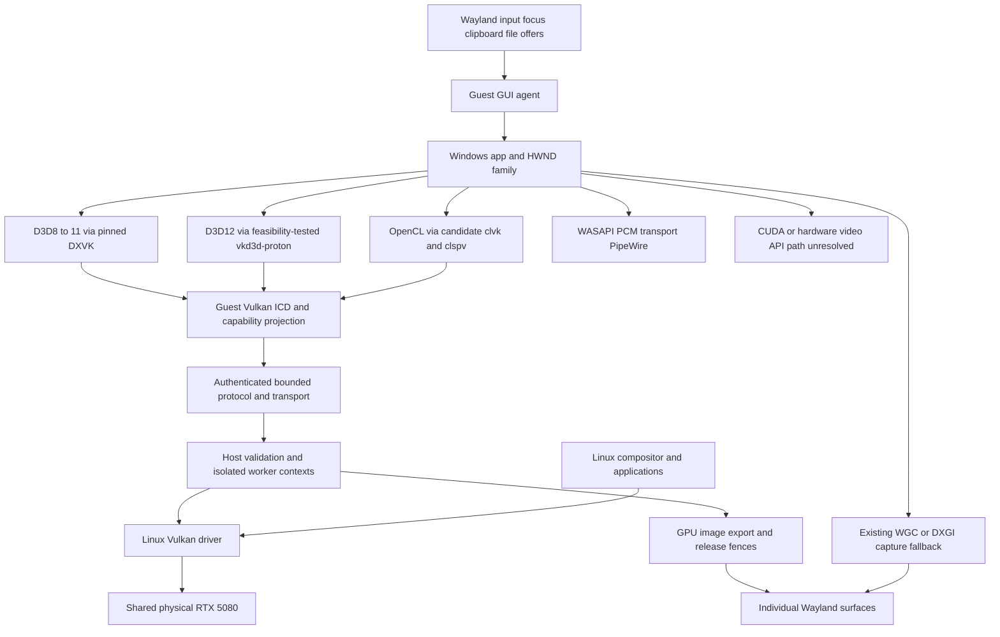

# Shared GPU Windows desktop roadmap

Evidence reviewed: **2026-10-08 UTC**. This document is a proposed implementation and acceptance roadmap for Waddle-LSW. It is self-contained for a new agent, but does not authorize implementation, dependency changes, driver installation, VM mutation, or a merge. The user controls those decisions. This publication adds only this file directly under `impl/`, as explicitly requested; it does not create a feature subfolder or alter existing trackers.

## 1. Goal and boundaries

Run Windows applications inside the existing Windows subsystem/VM on Linux, presenting each application and its necessary dialogs as individual native Wayland windows. Make GPU acceleration useful in bounded Photoshop and Premiere Pro workflows. **Linux applications and Windows applications must use the same RTX 5080 simultaneously.** Linux retains ownership of the physical device and its driver; guest API/ICD components submit validated graphics and compute work to a host service.

Exclusive PCI passthrough is outside the chosen architecture. Do not unbind the Linux driver or transfer exclusive GPU ownership to the VM. Software context separation, quotas and scheduling are the intended sharing mechanisms. Do not describe the consumer RTX 5080 as providing proven hardware partitions, SR-IOV or guaranteed VRAM isolation. The historical phrase “software vGPU slicing” names the repository feature; it does not establish hardware partitioning.

Success means a reproducible, interactive, correct application workflow with measured acceleration and concurrent Linux GPU work. A triangle, loader enumeration, `clinfo`, an app launch, a captured screenshot, or successful CI is useful intermediate evidence but does not prove that outcome. No near-native performance, general Adobe compatibility, delivery dates or vendor support is promised here.

Keep the implementation policy in [AGENTS.md](../AGENTS.md): C by default, Zig at required memory-safety/untrusted-parser boundaries, and C++ only where compatibility requires it. Rust and Go remain disallowed. Early toolchain prose in [CONTRIBUTING.md](../CONTRIBUTING.md) conflicts with its later language policy; use the explicit policy and user direction, not that stale setup suggestion. Third-party code needs pinned submodules, license review and an explicit compatibility boundary. A Rust-free C++ dependency candidate is still subject to that review.

## 2. Evidence ledger and what is current

Two distinct snapshots were inspected. Do not collapse them into one accepted release:

| Snapshot | Identity and provenance | What it establishes |
| --- | --- | --- |
| Published feature baseline | GitHub `feature/software-vgpu-slicing`, `01d910ccfb7af0233ab8d8c45a91856deaffb0c2`, commit time `2026-10-07T09:48:52-04:00`; verified with `git ls-remote` on the review date | This roadmap's parent. Existing linked source paths refer to this tree unless stated otherwise. |
| Newer active local history | Discovered project checkout `/home/dev/Waddle-LSW`; HEAD `cb0b0d5838d753fe14a8d4d320158a47152f57d5`, `2026-10-07T18:17:58-04:00` | Additional committed local code and qualification records were present, but were not at the remote head. This document's publication must not publish those commits implicitly. |
| Active untracked work | Empty staged index and no tracked working-tree diff at inspection; untracked properties safety scripts, DXVK shader/compiler fixture files and Python caches | Worker-owned work, not qualification or contents of this publication. The state may change while workers continue. |

At the published baseline, [GPU tracker](software-vgpu-slicing/TRACKER.md) reports transport #1=100%, host receiver #2=100%, guest WDDM/ICD #3=55%, DMA-BUF/Wayland #4=100%, OpenCL #5=0%, overall **68.75%**. These are scoped implementation percentages, not Adobe readiness. [Handoff](software-vgpu-slicing/HANDOFF.md) describes public Vulkan 1.0, no extensions and optional feature flags false. Linux RTX graphics/compute evidence is real, while native Windows loader/device fixtures at that checkpoint use a mock frontend. Authenticated real Windows-to-host GPU and modern pinned DXVK acceptance remained open there.

The newer local tracker changes #3 to **90%**, overall **77.5%**, and records modern functionality and actual Windows GPU qualification. Its last documentation commit is [cb0b0d5](https://github.com/Kayyo321/Waddle-LSW/commit/cb0b0d5838d753fe14a8d4d320158a47152f57d5); this link may be unavailable until that local history is published. The local tracker reports whole-core coverage 90.07% branch/98.50% line at `37df8b4`, current required ICD checks, a 12-case actual Windows Vulkan matrix, and repeated WSI. It also explicitly retains the **DXVK compiler locale/TLS heap qualification blocker**, even after functional lifetimes and a tracked SetupAPI owner fix. Do not carry the old Vulkan 1.0 ceiling forward as the latest local implementation, or declare TODO #3 complete from those newer reports.

Read-only spot checks found the newer log `build/icd_final_current_test_san_windows.log`, matrix `build/wddm_dxvk_checkpoint/final_vulkan_a64647c8/results.json` (positive cases contain real native/host exit and owner retirement fields), and `build/windows11_vm/tcp_gpu_e7b07008/result` (host status 0, worker retired). The tracker attributes 48 frames/eight lifetimes to that WSI run. These ignored, machine-local artifacts are **not shipped in this document**, and the full raw receipts were not independently re-audited or rerun. A successor must obtain immutable source/binary hashes and raw outputs before adopting any local claim into a new release gate. A later handoff can lag the tracker; check both against source and receipt provenance.

GitHub Actions API results were rechecked on the review date for exact SHA `01d910c`: [Linux CLI verification](https://github.com/Kayyo321/Waddle-LSW/actions/runs/37631620743), [Native AV verification](https://github.com/Kayyo321/Waddle-LSW/actions/runs/37631620677), [Software vGPU verification](https://github.com/Kayyo321/Waddle-LSW/actions/runs/37631620496) and [Native Windows guest](https://github.com/Kayyo321/Waddle-LSW/actions/runs/37631620522) are completed/success. Four workflow definitions exist in [.github/workflows](../.github/workflows). This resolves stale pending CI statements for that SHA only; CI cannot certify newer local code or physical desktop acceptance.

### Current components and gaps

| Area | Source of evidence | Existing foundation and remaining boundary |
| --- | --- | --- |
| VM/session/files | [QEMU arguments](../src/daemon/daemon_qemu.c), [QMP](../src/daemon/daemon_qmp.c), [filesystem manager](../src/daemon/daemon_fs.c), [guest process](../src/guest/guest_process.c) | QEMU/KVM/QMP launch, virtiofsd management and ConPTY/session infrastructure exist. Production app activation, filesystem semantics and seamless GUI lifecycle still need acceptance. |
| Window discovery | [av_windows.c](../src/av/av_windows.c) | Win32 HWND discovery and geometry exist. Exact PID, tool/no-activate and owned-window filters can omit Adobe helpers, palettes and dialogs. |
| Capture/display | [av_capture.c](../src/av/av_capture.c), [av_wgc.cpp](../src/av/av_wgc.cpp), [av_video.c](../src/av/av_video.c), [av_wayland.c](../src/av/av_wayland.c) | WGC/DXGI capture and per-window `xdg_toplevel` exist. Staging GPU textures, mapping/readback and BGRA shared-memory publication make this a copying path; it is not end-to-end zero-copy. |
| GUI input | [AV protocol](../include/waddle/av_protocol.h), [guest_input.c](../src/guest/guest_input.c) | AV has create/destroy/geometry/frame/close/diagnostic messages. The reviewed Wayland client has no `wl_seat` keyboard/pointer binding. Guest input writes console stdin and handles console control; it is not GUI input remoting. |
| Audio | [WASAPI](../src/av/av_wasapi.c), [PipeWire](../src/av/av_pipewire.c) | WASAPI-to-PCM-to-PipeWire foundation exists. Clocking, reconnect, multiple app streams and app-level AV sync require measurement. |
| Resource capacity | [AV layout](../src/av/av_layout.h), [AV protocol](../include/waddle/av_protocol.h) | 16 windows, three 32 MiB slots each, 2 GiB mapping. A 3840×2160 BGRA frame is 33,177,600 bytes, just below one slot's 33,554,432-byte capacity; stride and larger/scaled windows need bounds checks. Forty-eight slots reserve about 1.5 GiB before metadata. |
| GPU transport/runtime | [ring](../src/vgpu/venus_ring.c), [RPC](../src/vgpu/venus_rpc.c), [receiver](../src/vgpu/venus_receiver.c), [worker](../src/vgpu/venus_worker.c), [TCP bootstrap](software-vgpu-slicing/TCP_BOOTSTRAP.md) | Bounded transport, validation, contexts, GPU work and cleanup infrastructure exist. Distinguish development TCP/named-file proofs from the selected production cross-VM deployment. |
| ICD/driver/WSI | [ICD](../src/vgpu/venus_icd.zig), [WDDM ownership](../src/vgpu/venus_wddm.c), [surface](../src/vgpu/venus_surface.c), [presentation](../src/vgpu/venus_present.c) | Userland adapter/context/allocation ownership is not an installed complete kernel GPU driver. DMA-BUF and newer surface work do not by themselves prove full HWND/app swapchain integration with the AV window path. |

Start from these foundations, not from a blank VM, compositor or audio implementation. Existing implementation contracts are in [AV design](high-perf-av-passthrough/IMPL_DESC.md), [GPU design](software-vgpu-slicing/IMPL_DESC.md) and [daemon design](subsystem-daemon-manager/IMPL_DESC.md). General architectural aspirations in [PROJECT.md](../PROJECT.md) are not acceptance receipts.

## 3. Vocabulary and target data flow

| Term | Meaning in this roadmap |
| --- | --- |
| GPU rendering | Raster/graphics execution producing canvas, preview or window pixels. |
| GPU compute | Shader/kernel processing of buffers/images; distinct from displaying the resulting image. |
| Video engines | Codec-specific hardware decode/encode such as NVDEC/NVENC. These are separate from rendering and generic compute. |
| API remoting | Guest calls are serialized, validated and executed through host graphics APIs. Guest-visible support is the implemented intersection of guest bridge, protocol and host capabilities. |
| Transport | Carries requests, replies, images and synchronization. A fast ring alone does not implement Direct3D, OpenCL or CUDA. |
| ICD | Installable client driver providing an API implementation to the Windows loader. It does not automatically create a complete WDDM kernel adapter. |
| WSI | Window-system integration: surface creation, swapchain images, acquire/present, resize and compositor release ownership. |
| DMA-BUF | Linux buffer-sharing handle. Host import/export can avoid a copy locally while the full guest-to-display path still copies. |
| PCI passthrough | VM owns an assigned physical device. Exclusive assignment conflicts with the required simultaneous Linux use. |

The following is the **target**, with candidate dependencies and unresolved video path marked explicitly. It is not a statement that all edges work today.

The host retains the GPU driver and compositor. A guest application uses the selected DLL/ICD path; validated requests reach a host-owned context and return results/errors/fences. Presentation associates an app HWND and swapchain with a stable host surface. Host compositor release and GPU completion govern image reuse. The capture fallback can display unsupported windows but must not hide software rendering or establish false GPU acceptance. A Wayland-focused window directs input to the correct guest HWND; guest audio and file IO use separate existing services.

### Shared interface contracts to settle before implementation

One designated owner must maintain each cross-track protocol/API contract. Parallel work can proceed after the owner freezes a versioned contract; do not let input, WSI and GPU workers independently edit shared headers or capability lists.

- Identify a session epoch, authorized process family, window ID plus generation, device/context and swapchain generation. Never reuse a stale HWND value as a valid cross-session capability. Negotiate protocol versions and optional facilities; reject incompatible peers explicitly.
- Specify little-endian wire values, maximum lengths/counts, alignment, overflow handling, error outputs, private staging before validation, monotonic whole-operation deadlines and cancellation. Never send raw pointers or trust guest handles as host handles.
- Define focus enter/leave, event ordering, pressed-key/button state, text composition and reset behavior. Input authority belongs to the focused allowed surface, with no background cross-app injection or shortcut escape outside the documented compositor policy.
- Define image ownership states: free, acquired, submitted, GPU-complete, compositor-owned, released. Record which actor owns every resource and when its last reference may retire. Presentation ACK, GPU completion and compositor release are separate events.
- Specify supported pixel formats/modifiers, row pitch, damage, color space, alpha and DPI transforms. Describe copying fallback explicitly. Version resize responses and reject frames from obsolete generations.
- Set per-session/window memory, object, queue and request-rate quotas; reserve Linux desktop headroom. Software quotas do not guarantee physical device isolation. A poisoned context must terminate or recover within bounded rules without silently reusing uncertain resources.

## 4. Dependency map and work ordering

| Track | Prerequisites | Main blocker / exit evidence |
| --- | --- | --- |
| A: reproducible ordinary app baseline | Existing VM/AV/session services | Exact image/build provenance and real interaction entirely through Wayland |
| B: desktop integration | A plus owned input/window contract | Correct focus, dialogs, input, clipboard, files and recovery |
| C: actual guest GPU correctness | Frozen current TODO #3 source/runtime, GPU lease | Real Windows shader results, capability honesty, Linux concurrency, safe retirement |
| D: integrated presentation/deployment | C and window identity contract from B | App HWND/swapchain lifecycle connected to host surface; installation path proven |
| E: early D3D12 feasibility, then Photoshop MVP | Capability inventory from C; functional B/D for MVP | Windows translation feasibility and exact Photoshop workflow |
| F: OpenCL feasibility and filter | C; approved dependency choice | Correct Windows kernel results and selected real filter |
| G: Premiere MVP | B/C/D plus explicit effects and video backend decision | Pinned timeline/export with separately proved effects/decode/encode |
| H: quality/performance/recovery | Correctness gates above | Measured desktop behavior and bounded regressions against native Windows |

Run ordinary-app UX (A/B) and low-level GPU work (C) in parallel where ownership allows. Start E's D3D12 capability/loading experiment and F's compute requirements audit early, before broad application coverage and visual polish. Prove one host GPU kernel/result and one pinned Photoshop workflow before promising generalized Premiere support. G's backend research can start early, but its app promise waits for concrete evidence. H instrumentation starts early; copy removal and broad tuning follow correctness. There are no time estimates until these feasibility gates yield measurements.

## 5. Milestone work packages and pass/fail gates

### A. Freeze a reproducible host/guest baseline

Inventory host kernel, distribution, GPU PCI identity, NVIDIA driver, Vulkan implementation, Wayland compositor/protocols, QEMU/KVM and firmware. Pin Windows edition/build, existing disk-image identity, virtio/IVSHMEM drivers, loader/ICD/DLL hashes, submodule SHAs, downstream patches, build mode and commands. Record CPU/RAM/VM allocation, screen scale and relevant configuration. Keep private credentials outside logs and Git.

Reuse the existing VM, firmware and TPM. Never invoke provisioning or reset scripts on the running worker VM as a baseline shortcut. Separate a developer diagnostic transport baseline from a deployable transport baseline. Have the VM owner export an immutable manifest/receipt or approve an isolated test clone before physical work.

Use a small ordinary Windows GUI app with text, menus, a file dialog and save/reopen behavior. First record the existing capture/display result and missing input as a failing checkpoint. After minimum B input is available, launch, type, select, resize, save, reopen and close entirely through its Wayland windows, without VNC/QMP assisting the accepted workflow. Console interaction does not close this gate.

**Pass:** another authorized agent can reproduce the workflow from the exact manifest, with correct saved content and clean natural retirement. **Fail:** missing hashes, manual hidden guest intervention, software-only success mislabeled GPU, or irreproducible image state. Deliver a manifest, build/deploy commands, screen recording and file checksum; subsequent gates reference this baseline.

### B. Complete GUI input and desktop behavior

Extend the AV control/input design before coding. Bind Wayland seat keyboard/pointer facilities; implement keymap translation, modifiers, repeat, pointer coordinates/buttons/scroll, focus, cursor images/hotspots, relative-pointer behavior when needed, and release all held input on focus loss/disconnect. Choose and document a Windows injection mechanism, integrity/UIPI limits and whether a driver is necessary. IME/text composition needs its own path and tests; translated key presses alone are insufficient.

Track a permitted process family and HWND ownership graph rather than indiscriminately exporting every guest window. Preserve transient parentage, modal blocking and dialogs, floating palettes, menus/popups, helper-process windows, tooltips and app shutdown. Reconsider the existing tool/owned-window exclusion with an explicit policy. Choose `xdg_toplevel` versus popup/transient representation within compositor constraints; avoid absolute host placement assumptions.

Add clipboard formats with bounded size, ownership and cancellation; start with text, then selected image/file formats. Design file drag/drop offers with approved shared roots, path normalization, guest/host access checks and expiry. Preserve Unicode, rename/replace, write flush, save cancellation, conflict and reconnect semantics. Verify WASAPI/PipeWire device changes, volume and AV clock behavior. A crash must remove stale surfaces, release input/audio/clipboard ownership and preserve saved files; reconnect creates a fresh epoch.

**Pass:** ordinary-app and later Adobe fixtures cover keyboard layouts, focus switching between Linux/Windows apps, pointer scale, IME, menus, owned dialogs, clipboard, drag/drop, audio and save/reopen. No stuck keys, lost modal window or cross-app input after reconnect. **Fail:** only main-window capture works, GUI operation needs QMP, or helpers escape policy. Deliver protocol/state diagrams, automated boundary tests and real compositor/guest recordings. Tablet pressure/tilt becomes an explicit H gate, not an implied property of pointer support.

### C. Finish TODO #3 with actual shared-GPU correctness

Continue from the **current worker checkpoint**, not an obsolete remote ceiling. Obtain an ownership lease before touching code, VM, GPU or interface files. Close the pending pinned DXVK native heap/compiler lifetime gate without suppressions, skipped assertions, widened tolerances or fabricated cleanup receipts. Preserve failed evidence. Distinguish an app-workload error, transport loss, actual device loss and forced cleanup in reports.

Exercise real authenticated Windows-to-Linux graphics and compute: uploads/flushes, command recording, descriptor/pipeline/query correctness, shader-produced readbacks/invalidation, barriers, fences, timeline/queue ordering, immutable samplers, resource lifetime and teardown. Compare deterministic pixels/words with independent native reference outputs. Linux-only physical tests and Windows mocks remain separate rows. Validate extension/features/limits as an implemented intersection, not a host capability passthrough.

During the acceptance window, run a bounded Linux GPU graphics/compute workload concurrently with the Windows workload and show both correct results and a responsive compositor on the same physical GPU. Record GPU identity, timestamps, utilization and workload hashes; two sequential runs do not establish sharing. Exclude model-router/inference GPU load and unrelated acceptance jobs. Only the owner starts or stops tests; do not kill other processes to create a benchmark environment.

Test malformed/truncated/replayed requests, quota exhaustion, timeout/cancellation, stale handles, disconnect at each ownership phase, memory pressure, and device/worker loss. Bound request memory and execution budgets; keep guest data private until validation. Verify whole process/module/handle graph retirement and prescribed sanitizer/coverage gates under repo rules. A successful host response without matched guest output and lifetime proof is insufficient.

**Pass:** reproducible real Windows graphics+compute outputs, concurrent Linux outputs, honest capability queries, exact-source safety/coverage, and all remaining TODO #3 qualification gates closed. **Fail:** fallback CPU rendering, only mocks, feature overstatement, leaked owned state, or unbounded shutdown. Completing C does not automatically complete Photoshop, OpenCL or installed kernel-driver deployment.

### D. Integrate HWND, swapchain and Wayland lifecycle

Connect window identity from B to GPU presentation from C. Specify surface creation, format/modifier negotiation, swapchain acquire/present, GPU completion, compositor release, resize and image-generation retirement. Preserve old images until GPU and compositor owners release them. Avoid treating a shared transport fence as sufficient for all ownership phases.

Exercise rapid resize, minimize/restore, occlusion, fullscreen, move between scale factors/outputs, app close during present, swapchain recreation, relaunch, lost connection and lost device. Freeze explicit synchronization/fallback behavior for the chosen compositor. Test capture-only dialogs beside directly presented GPU canvases, ensuring one HWND is not exported twice and fallback remains observable.

Decide deployment separately: an app-local DLL/ICD prototype, loader registration and rollback, or a production installed adapter requiring an actual kernel component, INF, signing and supported Windows installation. [venus_wddm.c](../src/vgpu/venus_wddm.c) is a userland ownership layer; its name is not kernel-driver completion evidence. If production needs a kernel portion, define it as a separate work package with privileges, signing and rollback requirements before implementation.

**Pass:** one real Windows app swapchain appears in its correct native Wayland surface through all lifecycle cases, with exact output and balanced image/FD/handle ownership. **Fail:** a host export demo works but guest app acquire/present does not, resize reuses stale backing, or install assumptions are untested. Deliver a joint window/swapchain state machine and deployment receipt.

### E. Investigate Direct3D feasibility early; qualify one Photoshop MVP

[DXVK documentation](https://github.com/doitsujin/dxvk/wiki) is the starting point for D3D8–11 translation. The existing pinned modern DXVK work is valuable but does not supply D3D12. Adobe's current [Photoshop technical requirements](https://helpx.adobe.com/photoshop/desktop/get-started/technical-requirements-installation/adobe-photoshop-on-desktop-technical-requirements.html) require DirectX 12 feature level 12_0 or later for Windows 26.x/27.x. Select an exact legally available Photoshop build rather than assuming older requirements.

Investigate [vkd3d-proton](https://github.com/HansKristian-Work/vkd3d-proton) as a D3D12 candidate. Upstream describes native Win32 DLL use and shared DXGI with DXVK, but Windows builds/use are primarily development/testing paths. Successful Proton applications do not prove Photoshop works in a Windows VM with this ICD. Pin a candidate and test Windows DLL loading, DXGI/adapter identity, feature queries, shader compilation, resource binding, command execution and presentation before committing to breadth. Compare its required Vulkan features/extensions against the actual guest ICD. A blocker here must redirect the proposal through user decisions, not fake D3D12 advertisement.

Then select one Photoshop MVP: exact build, input PSD/image hashes, dimensions/bit depth/color profile, GPU preference and diagnostics, chosen canvas zoom/pan/rotate and one bounded operation, modal save dialog, output file and native Windows reference. Record whether the chosen operation uses rendering, D3D compute, OpenCL, CPU or a remote/cloud service. GPU utilization alone is not backend proof; capture loaded modules/API evidence and correct accelerated output with fallback controls. Keep licensing/activation and internet-dependent functionality explicit.

**Pass:** the chosen adapter is accepted by Photoshop, the selected accelerated workflow and native Wayland interaction work, saved output matches the reference within a declared justified tolerance, and Linux GPU use remains concurrent. **Fail:** launch succeeds but GPU features are disabled, a CPU fallback passes, or dialogs are inaccessible. Adobe [GPU usage guidance](https://helpx.adobe.com/photoshop/desktop/get-started/technical-requirements-installation/photoshop-and-graphics-processor-gpu-card-usage.html) does not support GPU use under VMs/remote desktop; experimental success is separate from vendor-supported deployment.

### F. Choose and qualify a Rust-free OpenCL path for TODO #5

The tracker says **“rusticocl over Venus”**, but no exact pinned implementation or layer boundary is established by that name. Keep it an unresolved project term; do not silently rename it Rusticl or add Rust. Mesa [Rusticl](https://docs.mesa3d.org/rusticl.html) needs rustc/bindgen and works through Gallium. It is not automatically a direct Vulkan layer; a Vulkan-based Gallium route would additionally need evaluation of Zink and the Windows deployment boundary. That route conflicts with the current no-Rust policy unless the user changes it.

A candidate is [clvk](https://github.com/kpet/clvk), a C++17 OpenCL runtime ([build declaration](https://github.com/kpet/clvk/blob/main/CMakeLists.txt)) over Vulkan with Windows `OpenCL.dll` usage instructions, together with [clspv](https://github.com/google/clspv), which compiles supported OpenCL C to Vulkan shader SPIR-V. Upstream limits include one device per context, no out-of-order queues, device partitioning or native kernels, and compiler limitations. These do not establish Adobe support. Confirm the pinned C++17 build/toolchain and dependencies, license compatibility and policy approval before adding a submodule.

Inspect pinned [clvk device initialization](https://github.com/kpet/clvk/blob/main/src/device.cpp): below Vulkan 1.1 it requires the storage-buffer-storage-class extension path and queries features through the KHR Features2 path; it also consumes extended properties/features. A Vulkan 1.0/no-extension bridge is not plug-compatible. Enumerate the exact instance/device extensions, feature chains, SPIR-V capabilities, memory/descriptor/image limits and synchronization calls used by the selected pin. Implement and test only honestly supported capability projections. Do not equate host OpenCL conformance with guest-layer conformance.

Prototype a real Windows OpenCL kernel with known integer output, then image/format, events/ordering, compile-error, numerical, exhaustion and teardown cases needed by the selected Adobe operation. Prove the shader executes on the host RTX GPU and its result is returned correctly. Finally run an actual selected filter with output/reference and backend evidence; `clinfo` is discovery only. Establish whether that Photoshop version/filter uses OpenCL at all before making OpenCL a prerequisite for every Photoshop operation.

**Pass:** exact pinned candidate builds on Windows without Rust, runs the required kernels and real filter over the ICD, advertises accurate capabilities and retires cleanly. **Fail:** missing query/extension paths, unsupported kernel language/queue/image semantics, CPU fallback or discovery-only evidence. If unsuitable, document the blocker and alternative boundary for the user to decide.

### G. Qualify Premiere separately: effects, decode and encode

Select an exact Premiere build, legal input media, codec/profile, bit depth/chroma, resolution/frame rate, project duration, effects list, audio layout, export format and native Windows reference. Establish its selected renderer/effects backend and API requirements. A CUDA-dependent path is not supplied by a Vulkan bridge. An OpenCL or Direct3D alternative must be supported by the pinned app and demonstrated, not inferred from another release.

Maintain independent effects/rendering, hardware decoding and hardware encoding gates. Adobe's [decode/encode guidance](https://helpx.adobe.com/ie/premiere/desktop/get-started/technical-requirements/hardware-accelerated-decoding-and-encoding.html) describes format/GPU-dependent acceleration. NVDEC/NVENC and Windows vendor/video API discovery are additional integration problems; Vulkan compute and successful DXVK do not automatically expose them. Decide whether the first MVP permits software codecs while accelerating effects, or requires a separately designed video API bridge. Record that choice clearly; never label software export “hardware encoding.”

**Pass:** the selected timeline plays/scrubs with correct previews/audio, the chosen effects backend actually accelerates, export matches reference criteria, and each claimed hardware codec stage has API/engine evidence. Report dropped frames, export duration and fallback behavior while Linux GPU work runs. **Fail:** only an empty timeline works, hidden fallback is used, audio drifts, or a hardware-video claim rests on generic GPU load. Premiere acceptance is independent of Photoshop success.

### H. Measure usability, performance and resilience

After correctness, instrument input-to-presentation latency with identifiable event/frame tokens and clock correlation; distinguish CPU timestamps from actual display measurement. Report p50/p95, sample count, frame-time distribution, dropped/repeated frames and resize latency. Compare the same pinned project and GPU on native Windows, recording OS/driver differences. Agree numerical target budgets from measured baselines before accepting performance; no invented near-native threshold.

Measure host/guest CPU time, resident/shared memory, peak VRAM, transfer bytes, readback/copy/upload counts, queue stalls and encode/decode utilization. Optimize the existing capture/readback/copy chain only after outputs and lifetime ownership are correct. Local DMA-BUF zero-copy claims must identify the exact avoided edge; whole-path claims require tracing every edge.

Qualify color spaces/ICC, gamma, alpha, SDR before any HDR promise, Photoshop bit depths and Premiere export color. Test HiDPI/fractional scaling, multiple outputs and refresh rates, keyboard layouts, tablet pressure/tilt, cursor latency and pen mapping. Stress maximum window capacity, frames larger than current slots, VRAM pressure, bounded queues and guest/host disconnects. A crashed Windows app must not corrupt Linux workloads or require resetting the desktop. Device-wide host-driver faults remain a shared-GPU risk even with isolated worker processes.

**Pass:** correctness remains intact within agreed latency/resource/color budgets, recovery is bounded and documented, and regression tests cover each optimized ownership boundary. **Fail:** faster output is wrong, copy accounting is incomplete, Linux becomes unusable under normal agreed load, or cleanup needs unowned process termination.

## 6. Acceptance matrix and evidence discipline

Every row starts **untested for the final integrated product**, even where a component has prior evidence. Use statuses `verified`, `failed`, `blocked`, `untested`, and `not claimed`; attach a reason to blocked/not-claimed rows. A mock cannot change a physical row to verified.

| Gate | Required test environment / observable result | Current roadmap assessment |
| --- | --- | --- |
| Reproducible deployment | Exact frozen host/guest manifest and deploy/rollback replay | Existing infrastructure; final baseline untested |
| Ordinary GUI app | Entire workflow through native Wayland, correct saved file | Blocked by missing reviewed AV GUI input |
| Window family/input | Main, helper, owned dialog, menu, palette, focus and IME | Untested integrated product |
| Vulkan rendering/compute | Real Windows shader outputs, fences and cleanup | Newer local receipts exist; remote and local qualification scopes differ |
| Shared GPU | Simultaneous Linux/Windows correctness on RTX 5080 | Final integrated concurrency untested |
| Lifetime/security | Invalid wire, quotas, loss and entire owner retirement | Component coverage exists; final integration must repeat affected gates |
| HWND/WSI | Actual app swapchain acquire/present/resize mapped to right surface | Component foundations; full desktop integration untested |
| DXVK | Pinned DLL device/present plus required native heap acceptance | Newer local functional evidence; heap qualification blocked |
| D3D12 | Actual Windows translation and required feature level/workflow | Untested feasibility |
| Photoshop | Pinned adapter diagnostics, accelerated canvas/operation, file reference | Untested; vendor VM GPU support absent |
| OpenCL | Real Windows kernel and selected actual filter, honest discovery | TODO #5 pending; candidate unselected |
| Premiere effects | Pinned backend/timeline/output reference | Untested |
| Premiere decode/encode | Per-codec API/engine proof and output correctness | Untested; separate backend decision |
| Desktop quality | Input latency, audio sync, color, scale, tablet, recovery | Untested integrated product |

Each accepted case needs UTC start/end, source and binary hashes, dependency pins/patches, Windows image/build, host driver/compositor, commands/configuration, expected and actual output, exit codes, GPU identity, concurrency workload, fallback/backend evidence and resource-retirement receipt. Record failures and forced cancellation as failures, not successful natural cleanup. Numerical tolerances are fixed before tests and explained per operation; exact integer/canonical pixel fixtures should use exact comparison.

Repo implementation gates include ≥90% required protocol/memory coverage and zero prescribed sanitizer/allocator leaks. Native heap/handle checks supplement them; passing a compiler sanitizer is not proof of native DLL teardown. Preserve raw artifacts privately when needed and reference immutable manifests without credentials. App outputs, protocol tests, mock tests, Linux physical tests, native Windows fixtures, actual Windows GPU tests and CI are separate evidence classes.

## 7. Risk register

| Risk | Consequence | Mitigation / decision trigger |
| --- | --- | --- |
| D3D12 requirements exceed bridge | Photoshop GPU rejection despite DXVK progress | Early E feature/loading experiment; stop breadth if required feature level cannot be proved |
| Windows DLL interception/adapter selection fails | App uses native fallback or wrong adapter | Pin app/DLL loader behavior and log actual backend; evaluate installed adapter separately |
| Guest capability overstatement | Crashes, bad shaders or false acceleration | Project only fully implemented/tested guest semantics; negative query tests |
| clvk incompatibility/policy boundary | TODO #5 stalls or language policy changes accidentally | Pin/audit candidate before adoption; no Rust substitution; real kernel then filter gate |
| CUDA/vendor video APIs absent | Premiere effects or hardware codecs unavailable | Select exact backend/version and independent effects/decode/encode decisions |
| Modal/helper windows filtered out | User cannot complete/save work | HWND family policy and real Adobe dialog/palette fixtures |
| Capture/readback cost and AV slot limits | High CPU/bandwidth use, 4K/multiwindow failure | Measure copies and capacity; validate stride/size; bounded fallback before optimization |
| Shared GPU memory/hang behavior | Linux compositor starvation or device-wide failure | Quotas, desktop headroom, deadlines, loss tests and explicit residual risk |
| Resource/compiler/native heap leakage | Long-lived app/VM exhaustion | Close current DXVK heap blocker and repeat independent owner teardown evidence |
| Color/input fidelity gaps | Incorrect creative output or unusable tablet/IME | Native reference images/files, declared color pipeline and device/input matrix |
| VM/vendor support and updates | Unsupported deployment and regression churn | Label experimental scope; pin app/image/driver; requalify updates |
| Parallel shared-checkout interference | Wrong source provenance or accidental publication | Single interface owners, explicit leases, index lock and isolated documentation publication |

## 8. Decisions and unresolved questions

**Fixed by user direction:** simultaneous shared RTX 5080 use; Linux physical-driver ownership; API forwarding architecture; individual native Wayland windows; useful bounded Adobe GPU acceleration; preserve repo language policy; this task publishes one roadmap only.

**Proposed, not adopted:** clvk/clspv for Rust-free OpenCL, vkd3d-proton for D3D12 feasibility, capture fallback beside direct presentation, and milestone sequencing above. No dependency or implementation change follows automatically from this document.

Resolve these with evidence and user decisions:

1. Which exact Photoshop and Premiere versions and first workflows are the acceptance targets? Which filters/effects actually use which API in those builds?
2. What are the current worker's frozen TODO #3 source/runtime, capability inventory and remaining native heap blockers? Which newer local commits/receipts will become the next published baseline?
3. Does app-local ICD/DLL deployment satisfy selected app discovery, or is a real installed WDDM kernel adapter required? What signing/privilege/rollback model is acceptable?
4. What did “rusticocl” originally intend? Is the C++ clvk dependency boundary acceptable under policy, and which pins/features are needed?
5. Which Wayland compositor/protocol subset, clipboard formats, drag/drop semantics, tablet devices and multi-output configurations must be supported first?
6. Is Premiere's first MVP effects acceleration with software codecs, or must it include hardware decode/encode? If hardware is required, what guest video API can actually be implemented and discovered?
7. What latency, throughput, resource and output-error budgets are acceptable after native baseline measurement? Which guarantees are realistic with a physically shared consumer GPU?

Optional reference: FreeRDP [3.32.0 release](https://www.freerdp.com/2026/09/23/3_32_0-release) advertises beta SDL RAIL support for X11/Wayland; [SDL3 RemoteApp work](https://github.com/FreeRDP/FreeRDP/pull/13133) can inform window/dialog/input design. This is an experimental comparison source, not a mandate to replace Waddle's existing architecture or proof of shared GPU/Adobe support.

External technical pages above were accessed on 2026-10-08; their moving branches are research references, not dependency pins. GitHub's HTML view of clvk `device.cpp` failed to expose source, so its raw upstream source was read instead. One guessed Photoshop requirements URL failed; the linked official technical-requirements page was successfully read. Verify upstream content again and pin exact revisions before implementation.

## 9. Concrete next actions and AI handoff

1. Read [AGENTS.md](../AGENTS.md), the relevant designs/trackers, and the current GPU handoff; inspect branch/head, dirty/index state and worker checkpoint. Establish source provenance before accepting newer progress. Preserve the current TODO #3 work and private test artifacts.
2. Ask the current GPU/VM owner for the frozen capability manifest and remaining heap qualification result. Do not seize its GPU/QMP/keyboard lease, launch an overlapping runtime, rebuild its frozen acceptance snapshot, or alter preserved firmware/disk/TPM. Do not run model-router GPU workloads during acceptance.
3. Select the exact app versions and bounded Photoshop operation. Audit D3D12 and OpenCL requirements against the actual guest projection. Produce a pass/fail feasibility table before generalized Adobe claims.
4. Define input/window-generation and HWND/swapchain ownership contracts with one owner per shared interface. Prepare a minimum ordinary-app Wayland input gate while C continues under its existing owners.
5. When separately authorized, prototype one real guest compute kernel and D3D12 device/workflow path, then the pinned Photoshop MVP. Record explicit blockers before extending to Premiere codecs or UI polish.
6. Only after integrated correctness, establish performance/color/input budgets from native Windows measurements and optimize the copying path.

The active shared-checkout handoff requires `/tmp/waddle_git_index.lock` across staging **and** commit, an initially empty index, and exact owned staged paths; its helper is `build/root_todo3_continuation/commit_owned.py`. Worker leases and frozen build inputs must be respected. This documentation task uses an independent clone/index based on the published remote SHA, still holds that coordination lock for its document commit, and publishes only this path. It does not move the active checkout's HEAD, modify its index, include untracked files or publish its newer local implementation history.

Before any later publication, check remote advancement, include only authorized changes, use a normal non-force push and verify the exact resulting commit/file. This document's publication creates a separate successor of the old remote baseline; the active worker's newer local history will need an authorized normal reconciliation with the document commit before its own later push. Do not reset the worker checkout or force-push to hide that divergence. Existing progress trackers receive no implementation credit from this roadmap, and README remains unchanged.
